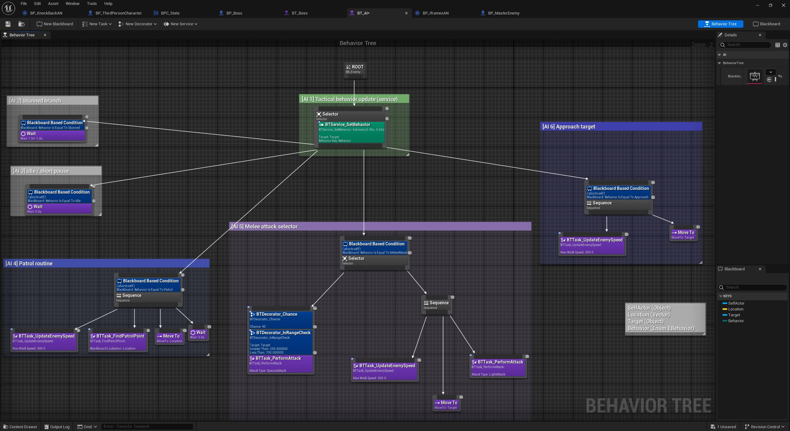
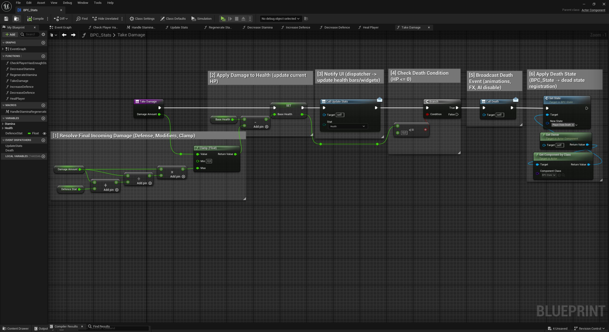
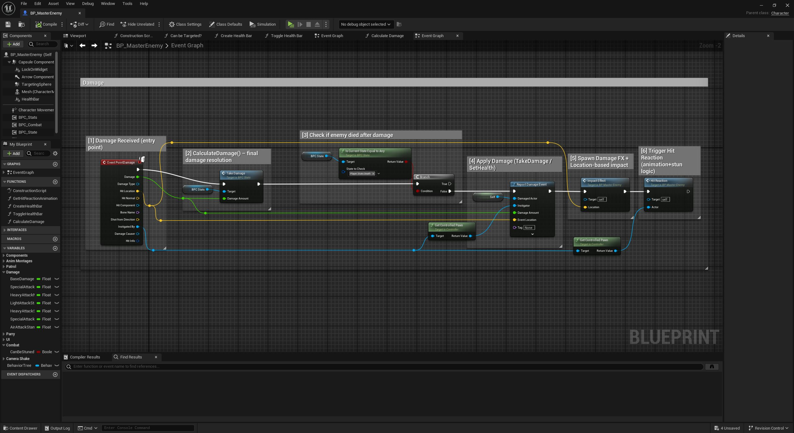

# Combat System – Unreal Engine 5 (Blueprints)

## Overview
Modular combat system implemented in **Unreal Engine 5 using Blueprints**, focused on AI-driven melee combat, damage handling, and animation-driven interactions.

The project demonstrates practical gameplay AI design using **Behavior Trees**, clean combat state management, and event-based damage application.

---

## Core Features
- AI-driven combat behavior using Behavior Trees
- Enemy state management (patrol, engage, attack, stunned)
- Boss combat variant
- Melee damage application
- Hit reaction handling
- Animation Notify–driven damage timing
- Modular interaction with environment (doors, pressure plates)

---

## AI Architecture

### Behavior Tree
The AI logic is built using a modular Behavior Tree structure:
- Patrol when idle
- Detect and approach target
- Execute melee attacks
- React to damage and stun states
- Fallback behaviors when target is lost

---

### Custom BT Services
Custom services dynamically update AI state:
- Distance checks to target
- Combat state switching
- Conditional execution of attacks

---

## Combat Logic

### Melee Attack Flow
- Animation montage triggers attack
- AnimNotify defines exact hit frame
- Damage applied only at correct animation timing
- Target validates hit and applies damage

This ensures tight synchronization between animation and gameplay logic.

---

### Damage Handling
- Damage received through Blueprint events
- Health updated based on incoming damage
- Hit reactions triggered conditionally
- Death state handled cleanly

---

## Boss Combat
A boss variant extends the base AI:
- Increased health and damage
- More aggressive behavior
- Expanded attack patterns

Boss logic reuses core combat components to avoid duplication.

---

## Video Showcase
*(YouTube link – AI behavior, melee combat, boss fight)*

---

## Technical Notes
- Implemented primarily in **Blueprints**
- Behavior Trees used for AI decision-making
- Clean separation between AI logic and combat execution
- Animation-driven gameplay via AnimNotifies
- Designed for easy extension (new enemies, attacks, behaviors)

---

## What This Project Demonstrates
- Understanding of UE5 AI systems
- Practical Behavior Tree usage
- Clean melee combat implementation
- Event-based gameplay logic
- Scalable combat architecture

