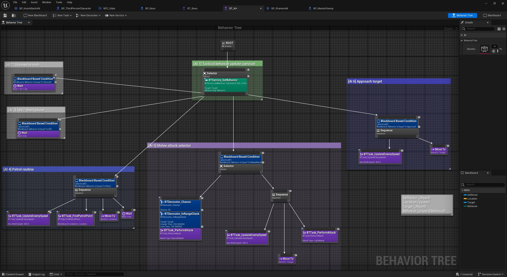
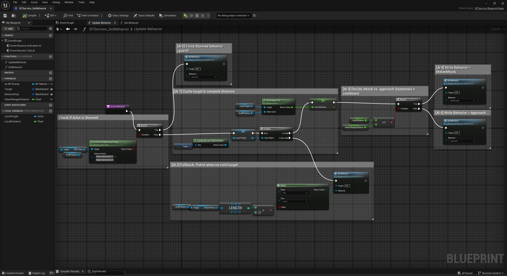
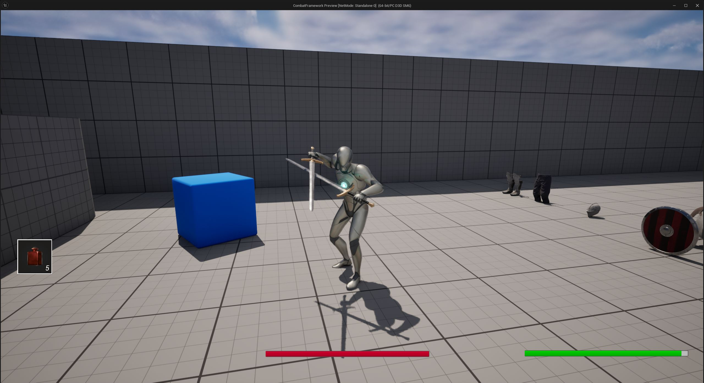
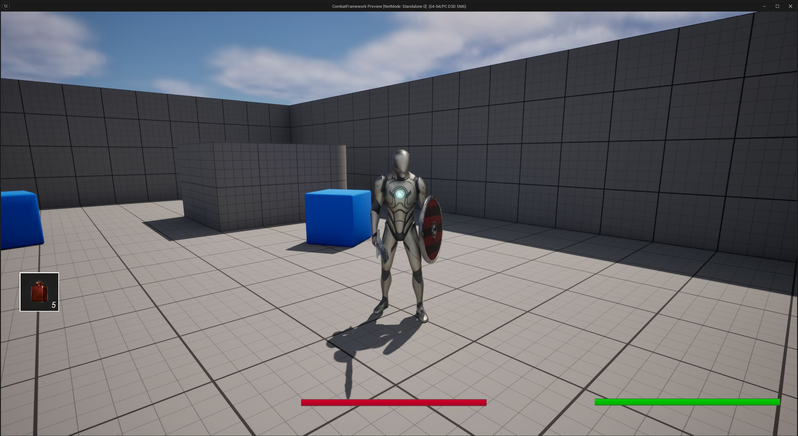
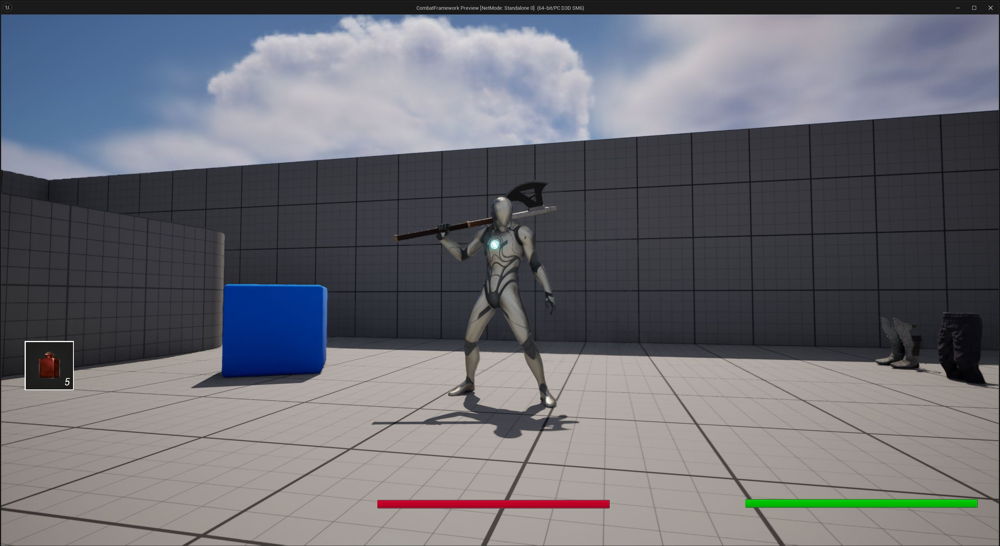
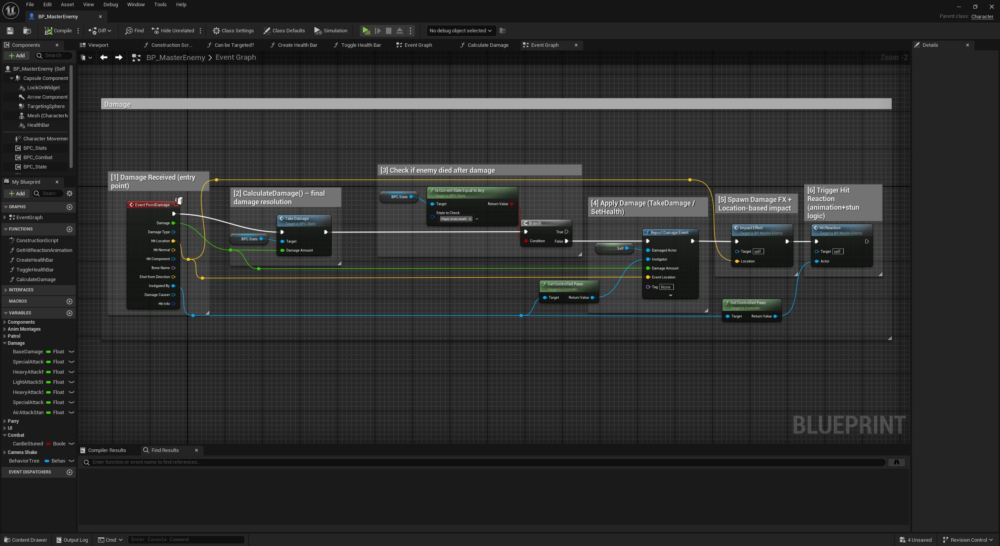
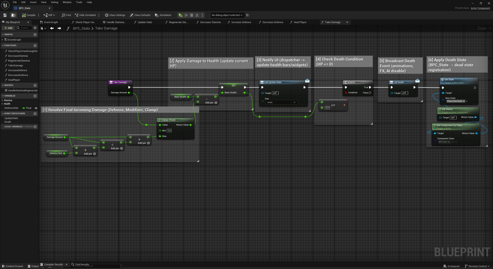

# Combat System - Unreal Engine 5 Blueprints

A solo learning project focused on melee combat, gameplay AI, damage handling,
and animation-driven attacks in Unreal Engine 5.

## Project Context and Attribution

This project was implemented independently while following a course-guided
foundation. I used it to develop practical experience with Blueprint
architecture, Behavior Trees, combat states, animation integration, and
connecting multiple gameplay systems into a functional combat loop.

The character models, animations, weapons, environment, and visual assets are
third-party assets. My portfolio focus is the gameplay implementation and
system integration rather than visual asset creation.

## Implemented Systems

- AI-controlled melee enemies
- Behavior Tree states for patrol, approach, attack, idle, and stun
- Distance-based transitions between approach and melee attack behavior
- Light and special attack selection
- Multiple weapon and animation configurations
- Animation-driven hit timing
- Damage calculation and health updates
- Hit reactions, impact effects, stun, and death handling
- Boss encounter using the same combat foundation

## Gameplay AI

Enemy decisions are organized in a Behavior Tree. Blackboard values store the
current target, destination, and combat behavior, while tasks and decorators
control movement and attack selection.

The tree separates patrol, approach, melee attack, idle, and stunned behavior.
This makes the current enemy state visible and easier to debug than placing the
entire decision flow directly in the enemy Blueprint.

### Behavior Update Service

A custom Behavior Tree service evaluates the enemy state and target:

1. Prioritize the stunned state when the enemy cannot act
2. Read and validate the current target
3. Fall back to patrol or idle when no target is available
4. Calculate the distance to the target
5. Select approach or melee attack behavior based on attack range
6. Write the selected behavior to the Blackboard

## Combat and Animation

The combat setup supports different weapon configurations, including dual
swords, sword and shield, and a two-handed weapon. Each configuration uses an
appropriate animation set while sharing the surrounding combat flow.

Attack montages control the visible action, while Anim Notifies determine when
the gameplay hit should occur. This keeps damage timing aligned with the
animation instead of applying damage immediately when the attack begins.

## Damage Pipeline

When an enemy receives a hit, the Blueprint resolves the damage and connects
the result with the remaining feedback systems:

1. Receive point damage and hit context
2. Resolve the final damage value
3. Pass the result to the reusable stats component
4. Update health and notify UI listeners
5. Trigger impact effects and a hit reaction when the target survives
6. Broadcast death and apply the dead state when health reaches zero

The stats component owns health modification, UI notification, the death check,
and the resulting state change. Keeping this logic in a component allows the
combat actor to delegate stat updates instead of owning every responsibility.

## Boss Encounter

The boss encounter uses the same general combat foundation while presenting a
more aggressive fight and a larger health pool. It demonstrates the combat,
damage, hit reaction, and AI systems working together in an extended encounter.

## Video Showcases

- [Weapon-Based Attack Animations](https://www.youtube.com/watch?v=aSLtklntbWc)
- [Boss Fight](https://www.youtube.com/watch?v=u2DFj_Ujph4)

## Technical Highlights

- Implemented primarily in Unreal Engine 5 Blueprints
- Behavior Tree and Blackboard-based gameplay AI
- State-driven transitions between patrol, approach, attack, and stun
- Animation Montage and Anim Notify integration
- Reusable Actor Components for stats and combat responsibilities
- Event-based UI, hit reaction, and death notifications
- Integration of multiple third-party animation and weapon sets

## What This Project Demonstrates

- Practical understanding of Unreal Engine combat and AI tools
- Ability to follow, analyze, and implement a larger gameplay architecture
- Connecting AI decisions, animation timing, damage, state, and feedback
- Organizing Blueprint graphs into readable and debuggable flows
- Integrating third-party assets into a functional gameplay prototype
