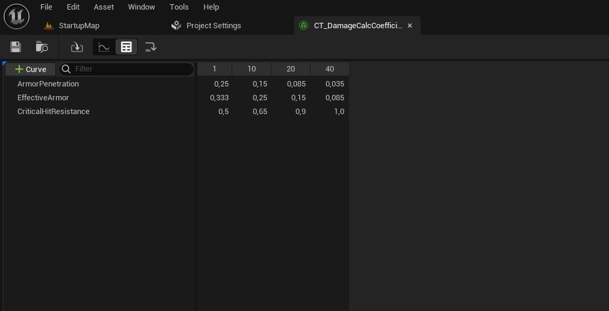
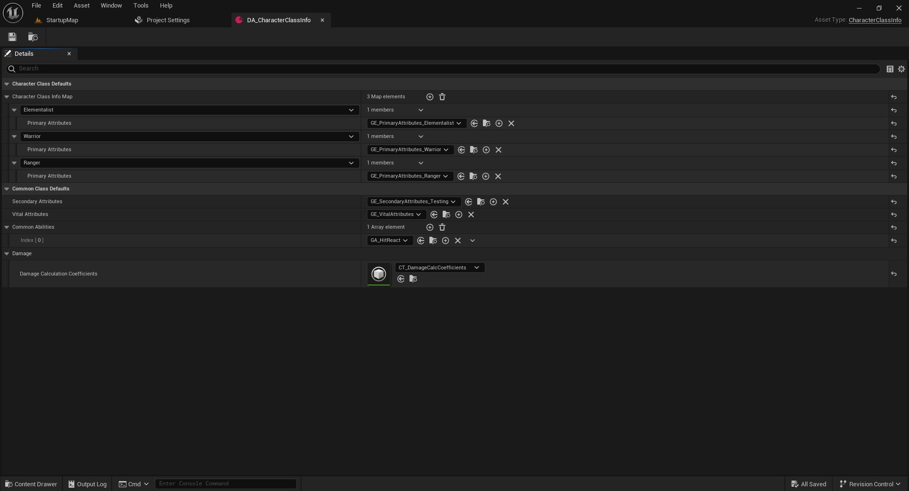

# GAS – Data-Driven Damage (ExecCalc + CurveTables)

This README presents a focused slice of the project: a **Gameplay Ability** (Fire Bolt) and a **data-driven damage pipeline** built with Unreal's **Gameplay Ability System (GAS)**.

---

## Overview

This project uses **Unreal Gameplay Ability System (GAS)** with a **server-authoritative, multiplayer-ready** damage pipeline. Damage numbers are computed in C++ via a custom **Execution Calculation** (`ExecCalc_Damage`) and tuned in data using a **CurveTable** referenced by a **CharacterClassInfo DataAsset**.

**What this shows:**
- GAS flow: **Ability → GameplayEvent → Projectile → GameplayEffect → ExecCalc**
- **Data-driven balancing** via CurveTables (no recompilation needed)
- Clean separation of concerns: data (DA/CurveTable) vs logic (ExecCalc)

---

## Screenshots

### 1) Gameplay Ability – Fire Bolt (Blueprint)


### 2) Gameplay Effect – Damage (Blueprint, data-only)


### 3) CurveTable – Damage Coefficients



### 4) DataAsset – CharacterClassInfo



---

## Damage Pipeline (high-level)

1. **GA_FireBolt** acquires a target location (mouse trace / hit result)
2. Ability plays a montage and waits for a **GameplayEvent** tag to spawn the projectile
3. Projectile applies **GE_Damage** on hit
4. **GE_Damage** uses **ExecCalc_Damage** to compute final damage
5. ExecCalc reads **CurveTable coefficients** (by row name) to scale damage based on level/attributes

---

## Data-Driven Damage Scaling (CurveTable)

Damage coefficients are stored in a `UCurveTable` and evaluated at runtime in `ExecCalc_Damage`.
The table is assigned in **DA_CharacterClassInfo**:

- `DamageCalculationCoefficients` → `CT_DamageCalcCoefficients`

**Curve rows used:**
- `ArmorPenetration` – scales armor penetration by **source level**
- `EffectiveArmor` – scales armor effectiveness by **target level**
- `CriticalHitResistance` – mitigates crit chance by **target level**

This enables designers to tune combat by editing curves without touching C++.

---

## Key Code – ExecCalc_Damage (C++)

Below are portfolio-friendly excerpts shown as separate blocks for readability.

### 1) Retrieve CurveTable from CharacterClassInfo

```cpp
// Retrieve damage coefficient curve table from CharacterClassInfo (DataAsset)
const UCharacterClassInfo* ClassInfo =
    UAuraAbilitySystemLibrary::GetCharacterClassInfo(SourceAvatarActor);

check(ClassInfo && ClassInfo->DamageCalculationCoefficients);

UCurveTable* CoeffTable = ClassInfo->DamageCalculationCoefficients;
const FString ContextString(TEXT("DamageCoefficients"));
```

### 2) Evaluate Armor Penetration (scaled by Source Level)

```cpp
const FRealCurve* ArmorPenCurve =
    CoeffTable->FindCurve(FName("ArmorPenetration"), ContextString);

const float SourceLevel = ICombatInterface::Execute_GetPlayerLevel(SourceAvatarActor);
const float ArmorPenCoeff = ArmorPenCurve ? ArmorPenCurve->Eval(SourceLevel) : 0.f;
```

### 3) Evaluate Effective Armor (scaled by Target Level)

```cpp
const FRealCurve* EffectiveArmorCurve =
    CoeffTable->FindCurve(FName("EffectiveArmor"), ContextString);

const float TargetLevel = ICombatInterface::Execute_GetPlayerLevel(TargetAvatarActor);
const float EffectiveArmorCoeff = EffectiveArmorCurve ? EffectiveArmorCurve->Eval(TargetLevel) : 0.f;
```

### 4) Evaluate Critical Hit Resistance (scaled by Target Level)
```cpp
const FRealCurve* CritResistCurve =
    CoeffTable->FindCurve(FName("CriticalHitResistance"), ContextString);

const float CritResistCoeff = CritResistCurve ? CritResistCurve->Eval(TargetLevel) : 0.f;
```
Full excerpt: [`Snippets/ExecCalc_Damage.cpp`](Snippets/ExecCalc_Damage.cpp)

### 5) Why this approach

- Balance quickly by editing curves (no code changes)
- Keep logic deterministic and server-authoritative for multiplayer
- Centralize tuning parameters in a single data source (CurveTable)

### Gameplay Video

▶ YouTube: https://www.youtube.com/watch?v=YOUR_VIDEO_ID

## Repository Structure

- `README.md` – overview of the GAS damage pipeline
- `Screenshots/` – visuals referenced in this README
- `Snippets/` – selected C++ code snippets (ExecCalc, AttributeSet, MMC)

This repository presents selected excerpts of a larger multiplayer GAS project,
focusing on core combat and damage logic.
