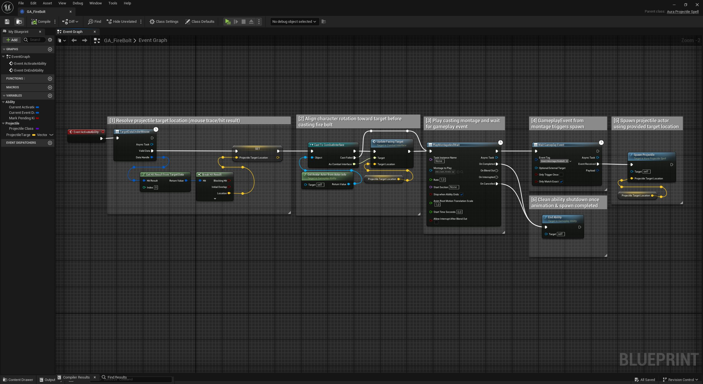
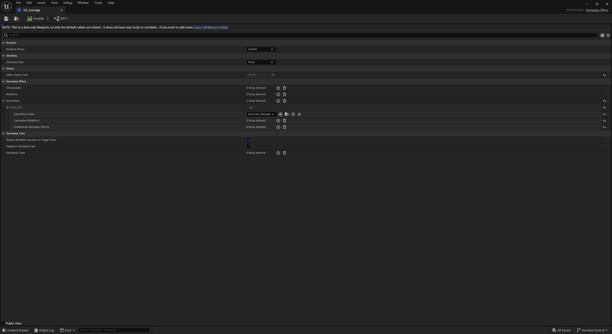
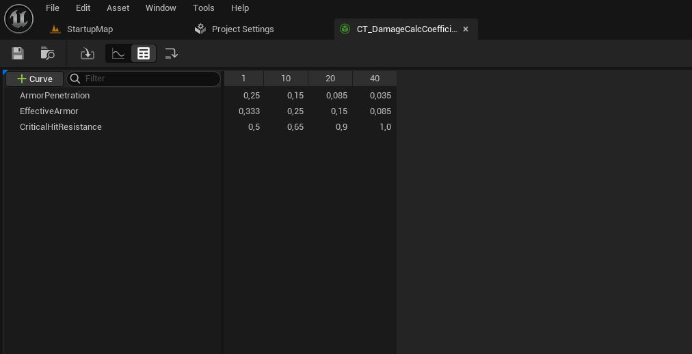
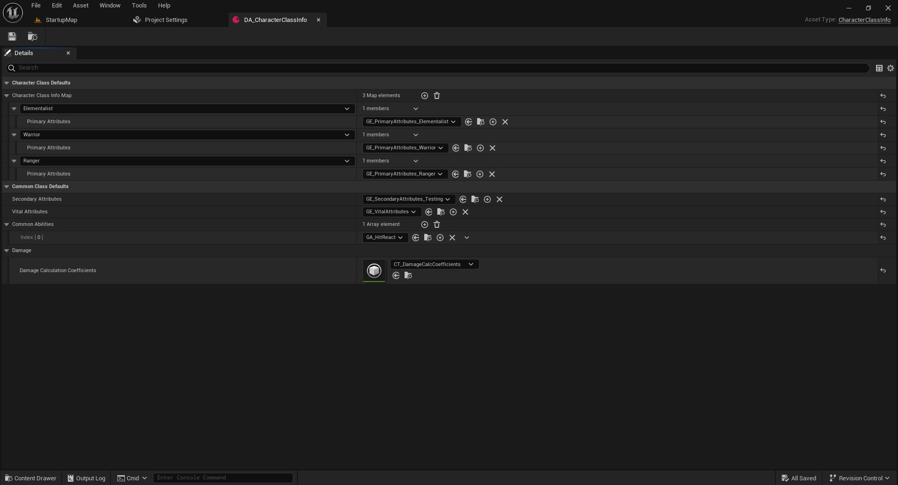

# Gameplay Ability System - Aura Learning Project

A solo learning project created to understand Unreal Engine's Gameplay Ability
System through practical C++ and Blueprint implementation.

## Project Context and Attribution

This project follows
[Unreal Engine 5 - Gameplay Ability System - Top Down RPG](https://www.udemy.com/course/unreal-engine-5-gas-top-down-rpg/)
by Stephen Ulibarri.

I implemented the systems while progressing through the course and used the
project to learn how the main parts of GAS communicate. The project contains
only minor modifications and the course was not completed in full.

The architecture, project concept, and most implementation decisions originate
from the course. This case study is included as a record of technical learning,
not as a claim of an independently designed RPG.

I later applied the acquired GAS knowledge in my engineering thesis, where the
Gameplay Ability System implementation was designed and developed independently.

## Learning Goals

- Understand the responsibilities of Ability System Components and Attribute Sets
- Create Gameplay Abilities and Gameplay Effects
- Use Gameplay Tags for damage types, input, states, and ability metadata
- Learn attribute capture and custom Execution Calculations
- Understand server authority and GAS replication patterns
- Connect C++ gameplay systems with Blueprint-authored abilities and effects
- Drive UI through attribute and ability state changes
- Keep combat balancing data outside the damage calculation code

## Implemented Course Scope

The local Unreal Engine 5.3 project includes:

- Player and enemy Ability System Components
- Replicated primary, secondary, vital, and resistance attributes
- Gameplay Abilities for projectiles, melee attacks, fire bolts, and summoning
- Gameplay Effects and SetByCaller damage magnitudes
- Native Gameplay Tags
- Custom Gameplay Effect Context data
- Custom damage Execution Calculation
- Magnitude Calculations for maximum health and mana
- Target data collection through a custom Ability Task
- Server-side ability and projectile operations
- Experience, level, attribute point, and spell point systems
- Attribute, overlay, and spell menu Widget Controllers
- Data Assets for abilities, attributes, character classes, and level progression

The project does not represent the completed course or a finished game.

## Portfolio Focus - Data-Driven Damage

The portfolio presents one focused part of the learning project: a Fire Bolt
ability and the damage pipeline that connects a Gameplay Ability, projectile,
Gameplay Effect, custom Execution Calculation, Attribute Set, and UI feedback.

### High-Level Flow

1. `GA_FireBolt` receives target data
2. The ability plays a casting montage
3. A Gameplay Event triggers projectile creation
4. The server spawns the projectile
5. The projectile carries a damage Gameplay Effect Spec
6. Damage values are assigned through SetByCaller Gameplay Tags
7. `ExecCalc_Damage` evaluates damage, resistances, block, armor, and critical hit
8. The result is written to the `IncomingDamage` meta attribute
9. `AuraAttributeSet` applies the result to health
10. Hit reaction, death, and floating combat text are triggered

## Gameplay Ability - Fire Bolt

The Blueprint ability coordinates target data, character rotation, casting
animation, Gameplay Events, projectile spawning, and ability completion.

The projectile itself is spawned through C++ only when the owning avatar has
authority. A Gameplay Effect Spec and effect context are created before the
projectile finishes spawning.

[View the projectile spell excerpt](Snippets/AuraProjectileSpell.cpp)

## Damage Gameplay Effect

The damage Gameplay Effect delegates final damage resolution to the custom
Execution Calculation. This keeps the Blueprint effect focused on configuration
while the calculation remains in C++.

## Custom Damage Execution

`ExecCalc_Damage` captures combat attributes and processes:

- Multiple damage types
- Matching target resistances
- Block chance
- Armor
- Armor penetration
- Critical hit chance
- Critical hit resistance
- Additional critical hit damage

The calculation stores block and critical hit results in the Gameplay Effect
Context so downstream feedback can display the correct result.

[View the damage calculation excerpt](Snippets/ExecCalc_Damage.cpp)

## Data-Driven Scaling

Level-dependent coefficients are stored in a Curve Table and referenced through
a Character Class Data Asset.

The presented rows control:

- Armor penetration effectiveness by source level
- Effective armor scaling by target level
- Critical hit resistance scaling by target level

Moving these coefficients into data allows balancing changes without rewriting
the execution calculation.

## Attribute Processing

Damage is routed through the transient `IncomingDamage` meta attribute. After a
Gameplay Effect executes, the Attribute Set:

1. Reads and resets incoming damage
2. Applies the value to health
3. Checks whether the hit is fatal
4. Triggers death or a hit reaction
5. Reads block and critical hit context
6. Sends floating combat text to the player controller

[View the Attribute Set declaration](Snippets/AuraAttributeSet.h)

[View the damage processing excerpt](Snippets/AuraAttributeSet.cpp)

## Replication and Authority

The course project introduced several multiplayer-oriented GAS patterns:

- Replicated attributes with RepNotify callbacks
- Mixed replication mode for the player Ability System Component
- Minimal replication mode for enemy Ability System Components
- Server RPCs for spending points and equipping abilities
- Replicated target data for abilities
- Server-authoritative projectile spawning

These patterns were implemented as part of the course project. They should not
be interpreted as an independently designed or production-validated multiplayer
architecture.

## Additional Code Excerpt

The project also contains a custom Modifier Magnitude Calculation that derives
maximum health from Vigor and player level:

[View the Max Health calculation](Snippets/MMC_MaxHealth.cpp)

## What I Learned

- How GAS distributes responsibilities across abilities, effects, attributes,
  tags, calculations, and effect contexts
- How server authority influences ability and projectile implementation
- How captured attributes are evaluated inside an Execution Calculation
- How meta attributes can separate damage calculation from health modification
- How Data Assets and Curve Tables support configurable combat systems
- How C++ GAS code can expose flexible configuration to Blueprints
- How gameplay state changes can drive UMG through Widget Controllers

This learning project provided the foundation for the independent GAS
implementation used in my engineering thesis.
