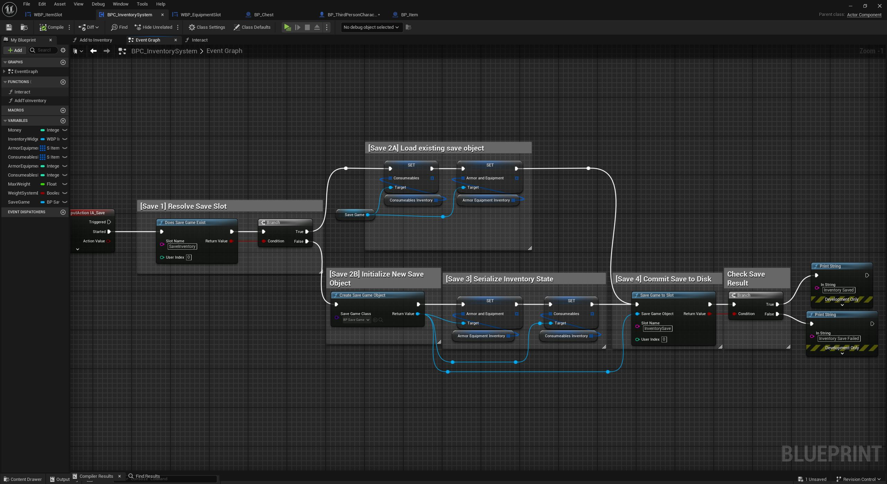

# Inventory System – Unreal Engine 5 (Blueprints)

## Overview
Modular inventory and equipment system implemented entirely in **Unreal Engine 5 Blueprints**.  
The project focuses on clean separation between **UI logic, item data, player interaction, and save/load flow**.

The system was designed as a reusable gameplay module rather than a one-off prototype.

---

## Core Features
- Item pickup via world interaction
- Inventory grid with slot-based storage
- Drag & Drop item movement
- Item stacking and stack validation
- Equipment system (weapons, armor)
- Item usage directly from inventory
- Chest / container interaction (loot extraction)
- Inventory persistence using SaveGame
- Blueprint Interfaces for interaction decoupling

---

## System Architecture
The system is split into clear responsibilities:

- **Item Actors**  
  World representation of items (pickup, interaction, data reference)

- **Inventory Component / Widget**  
  Handles storage logic, slot updates, and validation

- **Inventory Slot Widgets**  
  Responsible for drag & drop, hover logic, and item presentation

- **Equipment Slots**  
  Separate logic layer for equipping / unequipping items

- **SaveGame Layer**  
  Serializes inventory state and restores it on load

This separation allows easy extension (new item types, containers, equipment categories).

---

## Blueprint Highlights

### Add Item to Inventory
Handles:
- Stack merging
- Slot availability checks
- Partial stack handling
- Inventory refresh events

---

### Drag & Drop Logic
Implemented using UMG drag operations:
- Payload validation
- Slot compatibility checks
- Swap / move behavior
- Visual feedback during drag

---

### Item Interaction (Pickup)
World item interaction using Blueprint Interfaces:
- Player traces interactable actor
- Item validates pickup conditions
- Item data passed to inventory system
- Actor destroyed only after successful add

.JPG)

---

### Equipment Handling
Inventory items can be:
- Equipped to character slots
- Unequipped back to inventory
- Validated by item type (weapon / armor)

Equipment logic is intentionally decoupled from storage logic.

---

### Inventory Save / Load
Inventory state is persisted using UE5 SaveGame:
- Item IDs
- Stack counts
- Equipment state
- Slot positions

Allows restoring full inventory and equipment setup.

---

## Video Showcase
**Inventory System Showcase**  
*(YouTube link – drag & drop, pickup, equip, save/load)*

---

## Technical Notes
- Implemented **100% in Blueprints**
- Uses Blueprint Interfaces for low coupling
- Widget logic separated from data logic
- Designed to be expandable (containers, crafting, vendors)

---

## What This Project Demonstrates
- Strong understanding of UE5 Blueprint architecture
- UI-driven gameplay systems
- Data-driven inventory logic
- Clean interaction patterns
- Practical gameplay system design
