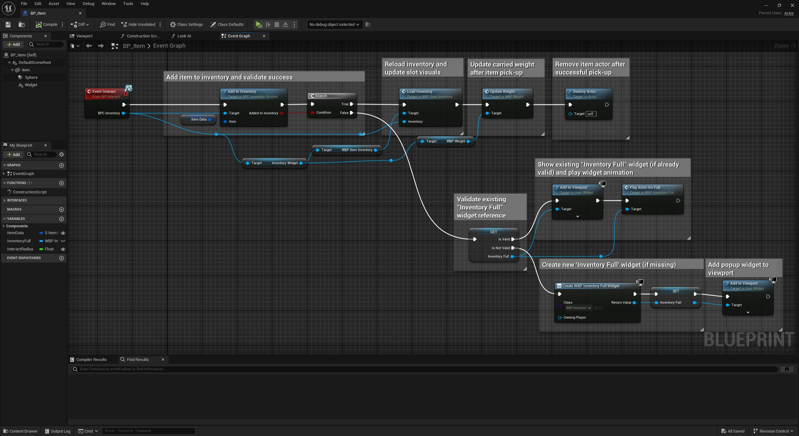
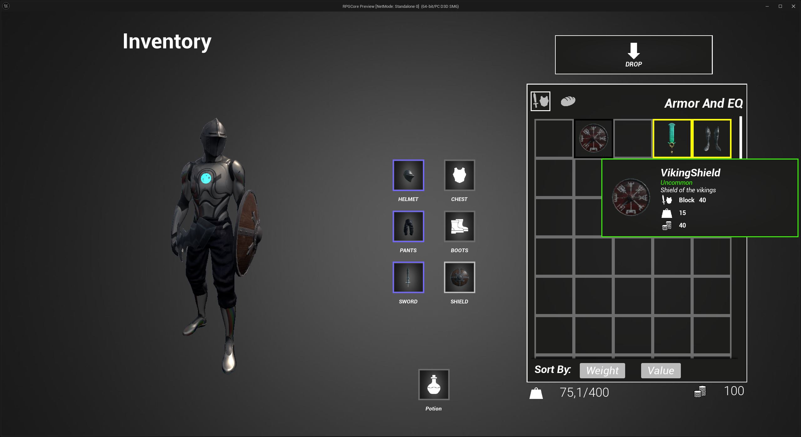
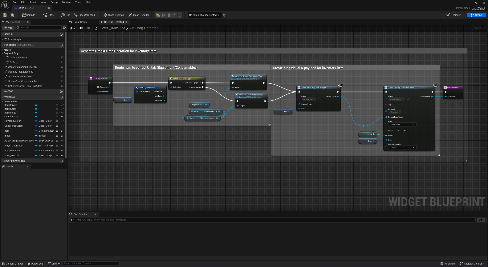
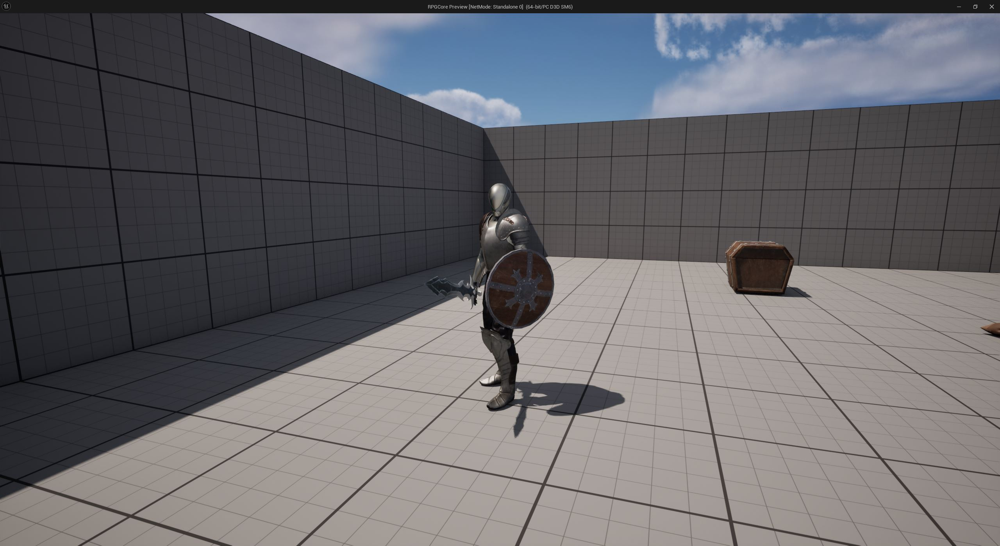
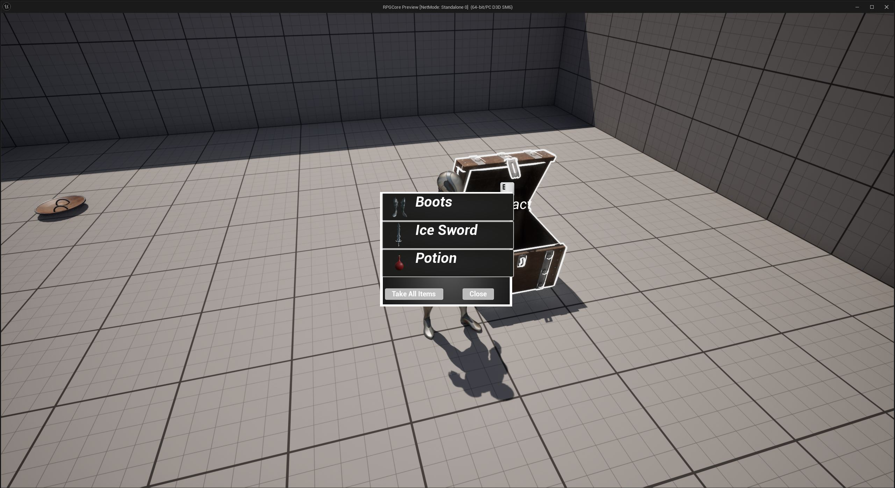
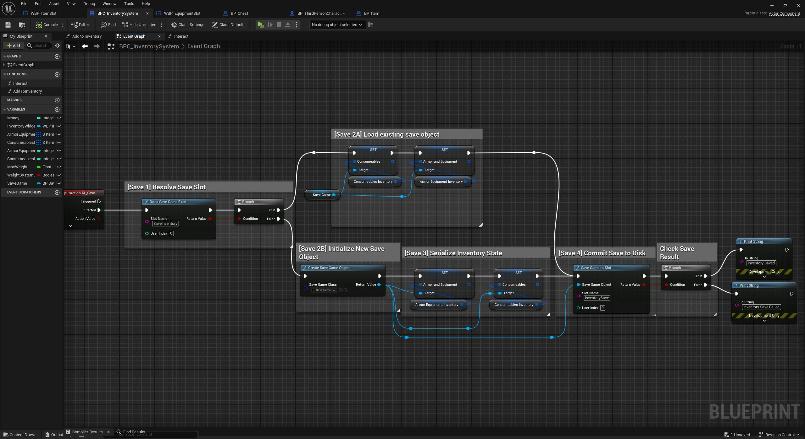

# Inventory and Equipment System - Unreal Engine 5

A solo Blueprint project focused on building a reusable inventory, equipment,
container, and persistence system in Unreal Engine 5.

## Project Overview

The project separates item data, inventory storage, UI presentation, world
interaction, and saving into distinct responsibilities. The goal was to create
a gameplay module that could support additional items, equipment categories,
containers, and interfaces without rebuilding the entire flow.

## Core Features

- World item pickup through a reusable interaction interface
- Slot-based inventory with item stacking
- Equipment and consumable item categories
- Drag and drop between compatible destinations
- Equipment slots with item type validation
- Equipped armor and weapons displayed on the character
- Item tooltips with rarity, description, weight, value, and statistics
- Inventory weight tracking
- Sorting by weight and value
- Chest and container interaction
- Item usage directly from the inventory
- SaveGame persistence for inventory and equipment state

## System Architecture

The system is divided into several gameplay and UI layers:

- **Item data** defines item identity, category, presentation, statistics, and
  stack information
- **World item actors** handle interaction and pass item data to the inventory
- **Inventory component** owns stored item collections and inventory operations
- **Inventory widgets** visualize categories, slots, weight, sorting, and
  tooltips
- **Equipment logic** validates slots and synchronizes equipped items with the
  character
- **Container actors** expose collections of items that can be transferred to
  the player
- **SaveGame layer** serializes and restores inventory and equipment state

This separation keeps world interaction and UI code from directly owning the
inventory data.

## World Item Pickup

World items communicate with the player inventory through a Blueprint
Interface. A pickup is removed from the world only after the inventory confirms
that the item was added successfully.

The interaction flow:

1. Receive the interaction request with the player's inventory component
2. Attempt to add the item and validate the result
3. Refresh the inventory slots and carried weight
4. Destroy the world actor after a successful pickup
5. Display inventory-full feedback when the item cannot be added

## Inventory UI and Item Information

The inventory screen combines:

- Equipment and consumable categories
- Grid-based item slots
- Equipped item slots
- Character preview
- Carried weight and currency display
- Sorting controls
- Item rarity and statistic tooltips
- A drop area for removing items from the inventory

## Drag and Drop

Item slots create a dedicated drag operation containing the item data, source
index, and destination type. Before creating the payload, the widget routes the
item to the appropriate inventory category.

The payload can then be validated by the destination slot to support moving,
equipping, unequipping, or rejecting incompatible items.

## Equipment

Equipment slots validate items by category before applying them to the
character. Equipped weapons and armor are kept separate from general inventory
storage while remaining synchronized with the UI.

## Containers

Chest actors expose their stored items through a container interface. The player
can select individual entries or transfer all available items into the
inventory.

Container transfers reuse the same inventory validation rules as world pickups,
so slot and capacity restrictions remain consistent.

## Save and Load

Inventory persistence is implemented with Unreal Engine's SaveGame system. The
save flow supports both updating an existing save object and creating a new one.

The current inventory collections and equipment state are serialized before the
save is committed to disk. The result is validated and reported for debugging.

## Video Showcase

[Watch the Inventory System gameplay showcase](https://www.youtube.com/watch?v=BCWIA-7Gt_U)

The video demonstrates item pickup, inventory UI, drag and drop, equipment,
tooltips, containers, and persistent inventory data.

## Technical Highlights

- Implemented entirely in Unreal Engine 5 Blueprints
- Reusable inventory Actor Component
- Blueprint Interface-based world interaction
- Separation of storage, item data, UI, equipment, and persistence
- Structured drag operation with item and slot context
- Success validation before removing world items
- Shared validation rules for pickups and containers
- SaveGame serialization for inventory and equipment

## What This Project Demonstrates

- Independent implementation of a multi-part gameplay system
- Blueprint architecture across gameplay, UI, and persistence
- Data flow between world actors, Actor Components, and UMG widgets
- Validation of inventory operations and UI feedback
- Designing systems for extension instead of a single scripted scenario
