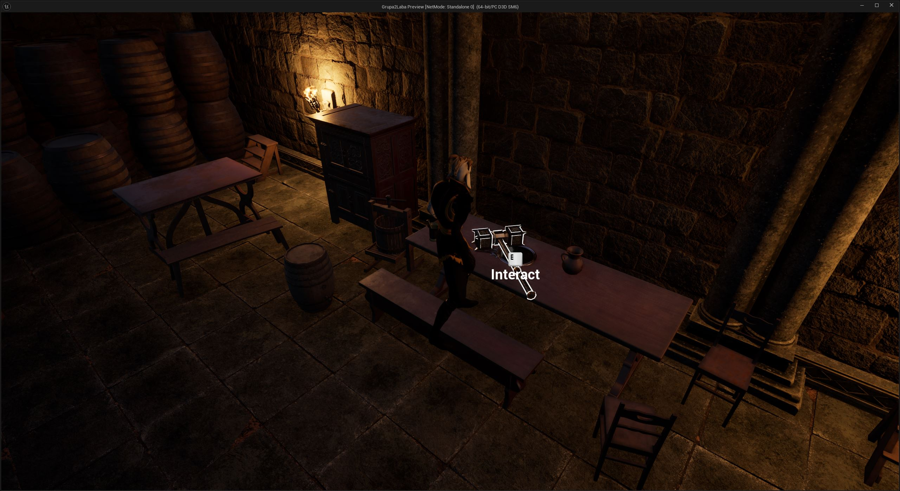
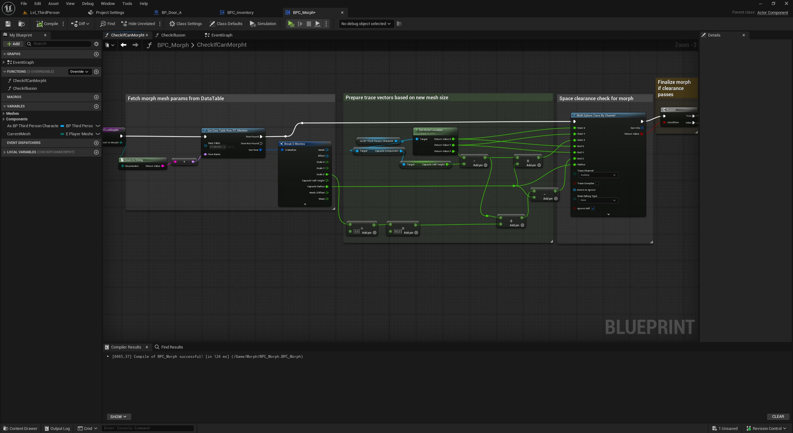
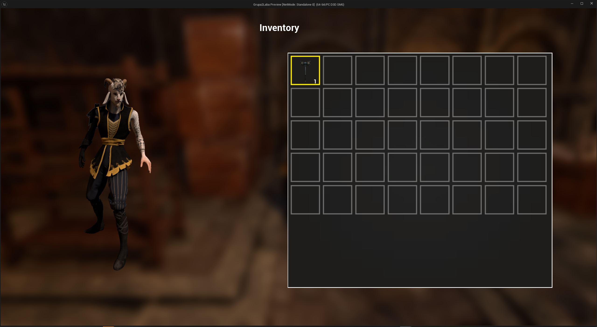
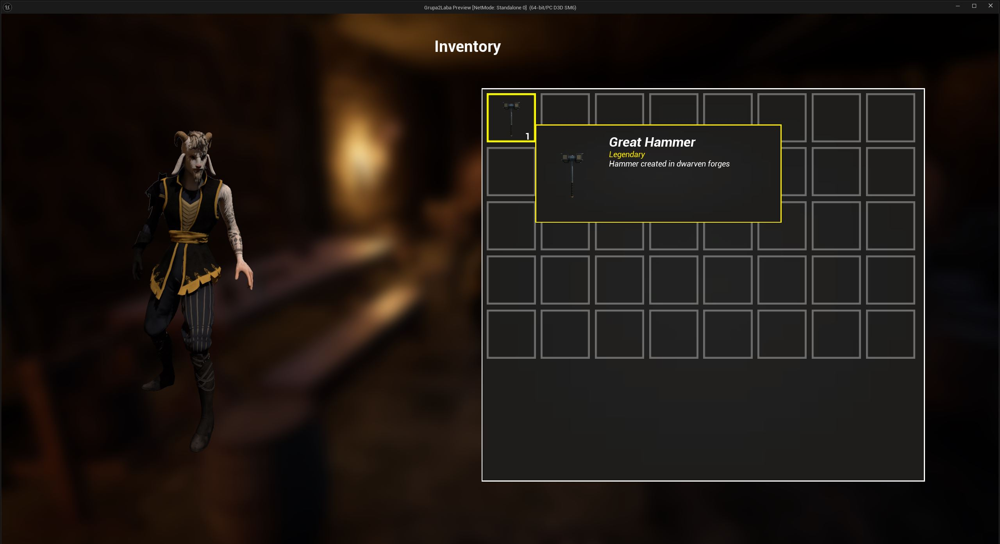
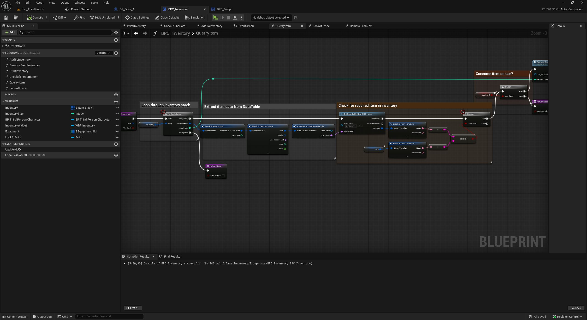
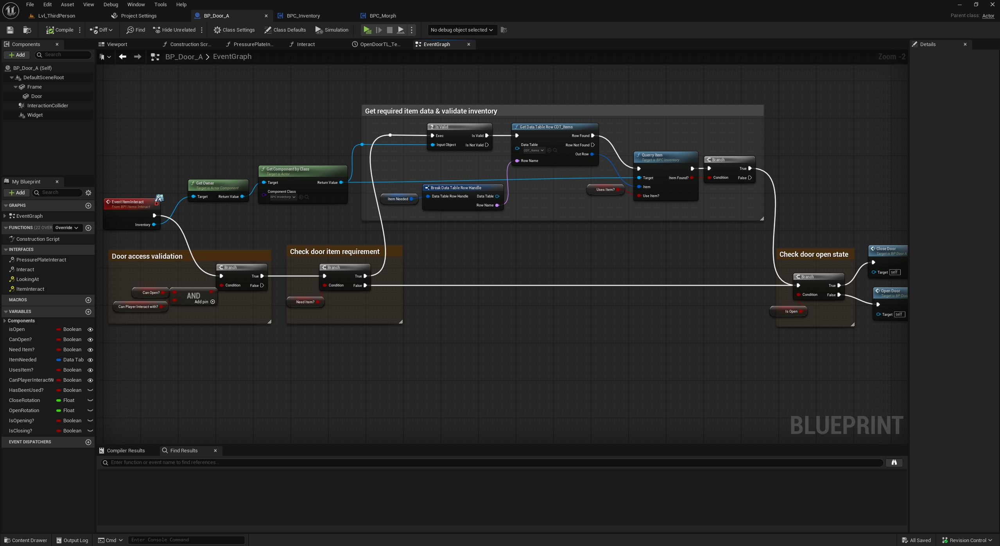

# TheMorph - Game Jam Gameplay Systems

TheMorph is a puzzle-focused Unreal Engine 5 prototype developed by a
**four-person team during a game jam**. Its core gameplay combines character
morphing, inventory items, and environmental interactions.

This case study focuses on the gameplay systems I implemented: the
**morph system**, **inventory**, and the **environment interaction framework**
used by pressure plates, puzzle elements, and doors.

## My Contribution

I was responsible for:

- Designing and implementing the character morph system
- Validating whether the player has enough space to change form
- Building the inventory and item lookup logic
- Creating inventory UI and item tooltips
- Implementing reusable interaction logic for environmental objects
- Creating pressure plate and puzzle interactions
- Implementing doors that can require a specific inventory item, such as a key
- Connecting inventory validation with world interactions, including optional
  item consumption

The complete game was a team effort. The sections below document the systems
that were part of my individual contribution.

## Gameplay Overview

The player can collect items, store them in an inventory, change physical form,
and interact with puzzle objects placed throughout the environment. Puzzle
progression can depend on the player's current form, activated pressure plates,
or possession of a required item.

## Morph System

Morph configuration is stored as data rather than being hard-coded into a
single transformation flow. Before applying a new form, the system retrieves
the target mesh parameters and performs a clearance check based on the new
collision size.

The transformation is completed only when the target form can safely fit in the
available space. This prevents the player from morphing inside walls, ceilings,
or other blocking geometry.

### Morph Validation Flow

1. Read the selected form and its parameters from a Data Table
2. Retrieve the target mesh and collision dimensions
3. Build a clearance query around the player
4. Check the required space against blocking geometry
5. Apply the morph only when the clearance test succeeds

## Inventory System

The inventory stores collected items and exposes reusable lookup logic for
other gameplay systems. Item definitions are retrieved from a Data Table, which
keeps item data separate from the interaction logic.

The UI presents inventory slots, stack quantities, item rarity, descriptions,
and tooltips.

### Item Query and Consumption

Environmental actors can ask the inventory whether the player owns a required
item. The query iterates through the stored item stacks, resolves their item
data, and compares them with the requested item.

The caller can also decide whether a successful interaction should consume the
item. This allows the same query to support permanent tools, reusable quest
items, and consumable keys.

## Environmental Interaction

The interaction layer connects the player, inventory, and puzzle actors.
Supported interactions include:

- Pressure plates
- Doors and other usable actors
- Puzzle elements activated by player interaction
- Objects that require a specific inventory item
- Doors that validate access before opening
- Interactions that optionally remove the required item after use

For item-gated doors, the actor retrieves the required item definition, queries
the player's inventory, and opens only when the validation succeeds.

## Video Showcases

- [Pressure Plate Interaction System](https://www.youtube.com/watch?v=cx0zN0UZHC8)
- [Inventory, Door Interaction and Mesh Morph System](https://www.youtube.com/watch?v=F1mlgf27qoM)

## Technical Highlights

- Implemented in Unreal Engine 5 Blueprints
- Data-driven morph and item definitions
- Collision-based morph clearance validation
- Reusable inventory query logic
- Inventory-aware environmental interactions
- UI feedback through inventory slots and item tooltips
- Gameplay systems integrated within a four-person game jam project

## What This Project Demonstrates

- Building connected gameplay systems under game jam constraints
- Designing reusable Blueprint logic instead of one-off level scripting
- Integrating character state, inventory data, UI, and world interactions
- Collaborating within a small development team
- Clearly defining and delivering an individual gameplay programming scope
